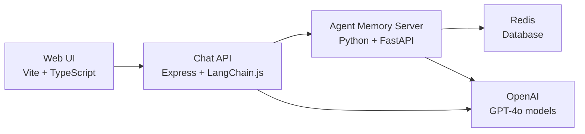

# PodBot - AI Podcast Recommendation Chat

PodBot is a specialized AI chatbot that provides personalized podcast recommendations and discusses all things podcasting. Built with modern web technologies and powered by OpenAI, it maintains conversation context across sessions using Redis Agent Memory Server.

## Quick Start

1. **Clone this repo**:

2. **Set up a .env file**:

```bash
cp .env.example .env
```

3. **Add your OpenAI API key** to `.env`:

```
OPENAI_API_KEY=your_openai_api_key_here
```

4. **Start all services**:

```bash
docker compose up
```

5. **Open your browser** to [http://localhost:3000](http://localhost:3000)

That's it! Enter a username and start chatting with PodBot about podcasts.

## How to Use

1. **Enter a username** and click "Load" to start or resume a conversation
2. **Ask about podcasts** - anything from recommendations to industry discussion
3. **Get AI-powered responses** with personalized suggestions based on your conversation history
4. **Clear your session** anytime to start fresh

## Architecture

PodBot is built as a microservices architecture with four main components:

### **Web Frontend**

- **[Vite](https://vitejs.dev/)** + **[TypeScript](https://www.typescriptlang.org/)** for fast development and type safety
- **[Nginx](https://nginx.org/)** reverse proxy for efficient static serving and API routing
- **[Marked.js](https://marked.js.org/)** for markdown rendering of bot responses
- **[FontAwesome](https://fontawesome.com/)** for modern UI icons

### **Chat API Backend**

- **[Node.js](https://nodejs.org/)** + **[Express](https://expressjs.com/)** for the web server
- **[TypeScript](https://www.typescriptlang.org/)** for end-to-end type safety
- **[LangChain](https://js.langchain.com/)** for LLM integration and message handling
- Clean architecture with adapters, services, and routes

### **AI & Memory**

- **[OpenAI GPT-4o-mini](https://openai.com/)** via LangChain for intelligent responses
- **[Redis Agent Memory Server (AMS)](https://github.com/redis/agent-memory-server)** for persistent conversation context
- Smart context window management for efficient token usage

### **Data Storage**

- **[Redis](https://redis.io/)** database for session storage and caching
- **[Docker Compose](https://docs.docker.com/compose/)** for orchestrating all services



## Key Features

- **Podcast-Focused AI**: Specialized chatbot that only discusses podcasts and recommendations
- **Persistent Memory**: Conversation history maintained across sessions
- **Modern UI**: Responsive chat interface with markdown support and loading states
- **Type Safety**: Full-stack TypeScript for reliable development
- **Container Ready**: Complete Docker setup for easy deployment
- **Fast Performance**: Vite for lightning-fast development and optimized builds

## Development & Testing

### API Testing

Test the backend directly with curl:

```bash
# Send a message
curl -X POST http://localhost:3001/sessions/testuser \
  -H "Content-Type: application/json" \
  -d '{"message": "Recommend some true crime podcasts"}'

# Get conversation history
curl -X GET http://localhost:3001/sessions/testuser

# Clear conversation
curl -X DELETE http://localhost:3001/sessions/testuser
```

### Local Development

```bash
# Backend development
cd chat-api && npm run dev

# Frontend development
cd chat-web && npm run dev

# View logs
docker compose logs -f chat-api
docker compose logs -f agent-memory-server
```

## Configuration

### Required Environment Variables

- `OPENAI_API_KEY` - Your OpenAI API key ([get one here](https://platform.openai.com/api-keys))

### Optional Environment Variables

- `AMS_CONTEXT_WINDOW_MAX` - Token limit for context window (default: 4000)
- `PORT` - Chat API server port (default: 3001)
- `AUTH_MODE` - AMS authentication mode (default: disabled)
- `LOG_LEVEL` - AMS logging level (default: DEBUG)

## Docker Services

The application runs as four containerized services:

| Service                 | Port | Description                                  |
| ----------------------- | ---- | -------------------------------------------- |
| **chat-web**            | 3000 | Frontend web interface (Nginx + Vite build)  |
| **chat-api**            | 3001 | Backend API server (Node.js + Express)       |
| **agent-memory-server** | 8000 | Memory management service (Python + FastAPI) |
| **redis**               | 6379 | Database for session storage                 |

## Useful Commands

```bash
# Rebuild and restart services
docker compose up --build

# Run in background
docker compose up -d

# Stop all services
docker compose down

# View all logs
docker compose logs -f
```

---

_For detailed implementation information, see [CLAUDE.md](./CLAUDE.md)_
